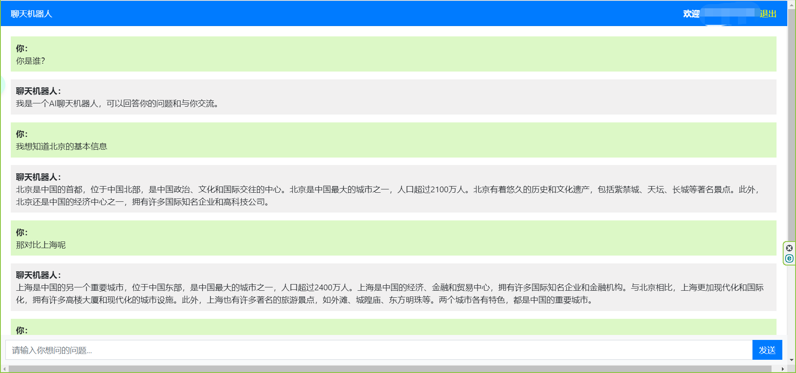

# 基于Django的ChatGPT聊天机器人

这个是一个基于Django构建的简单聊天机器人，通过调用OpenAI的接口进行聊天，主要用于练习接口的基本使用

## Features

- 基于Django
- 基于OpenAI的Completion与ChatCompletion开发
- 支持注册与登录，注册用户可存储聊天记录

## Installation

1. 克隆仓库:
``` shell
git clone https://github.com/yourusername/your-repo-name.git cd your-repo-name
```
2. 创建虚拟环境并激活
3. 安装依赖
``` shell
pip install -r requirements.txt
```
4. 应用数据库变更
``` shell
python manage.py migrate
```
5. 运行
``` shell
python manage.py runserver
```
打开：http://127.0.0.1:8000/

## Screenshot
